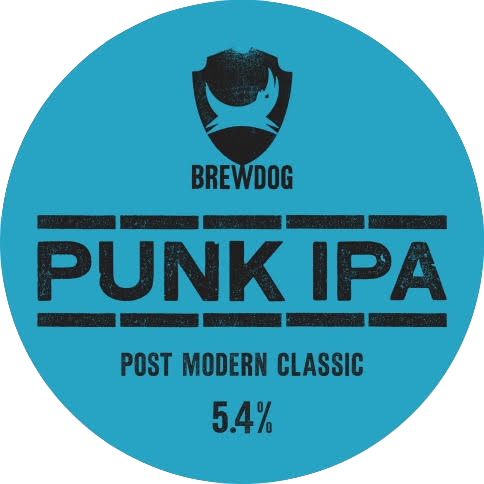

# homebrew-tap



## How do I install these formulae?

`brew install martindelille/tap/<formula>`

Or `brew tap martindelille/tap` and then `brew install <formula>`.

Or install via URL (which will not receive updates):

```
brew install https://raw.githubusercontent.com/martindelille/homebrew-tap/master/Formula/<formula>.rb
```

## Documentation

`brew help`, `man brew` or check [Homebrew's documentation](https://docs.brew.sh).
